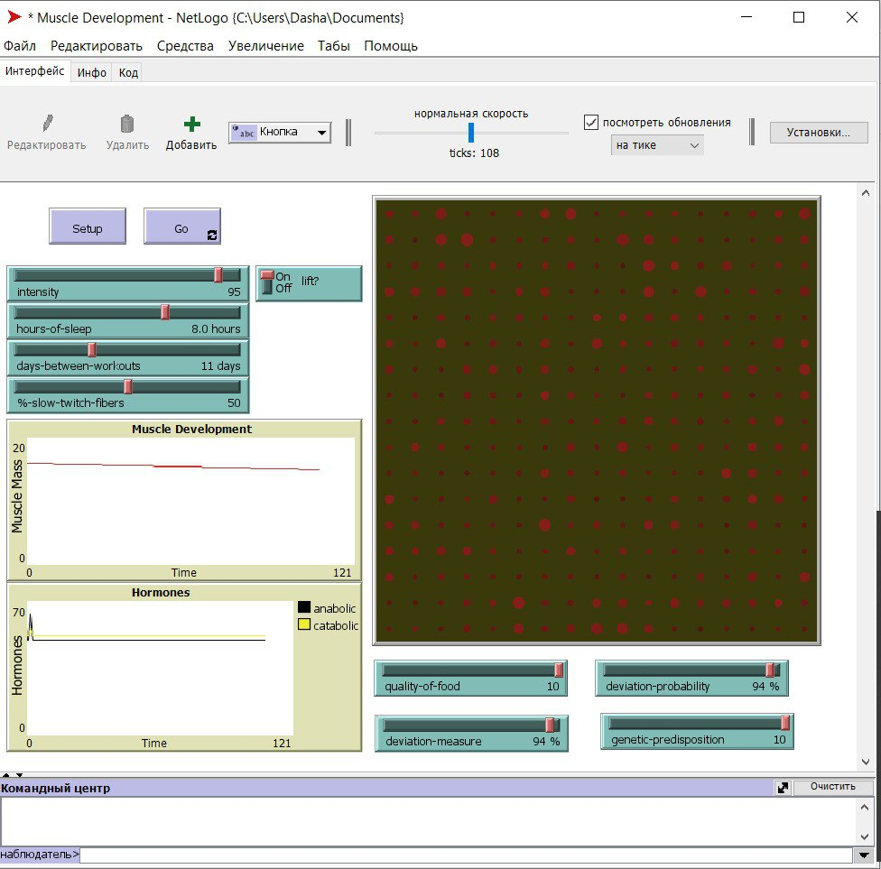

## Комп'ютерні системи імітаційного моделювання
## СПм-22-5, **Тимошенко Дар'я Олександрівна**
### Лабораторна робота №**2**. Редагування імітаційних моделей у середовищі NetLogo

 

### Варіант 12, модель у середовищі NetLogo:
[Muscle Development](http://www.netlogoweb.org/launch#http://www.netlogoweb.org/assets/modelslib/Sample%20Models/Biology/Muscle%20Development.nlogo)

 

### Внесені зміни у вихідну логіку моделі, за варіантом:

**Додано вплив харчування на можливість зростання м'язової маси.**
Для цього була створена нова процедура quality-food. Якість їжі є одним з найголовніших параметрів при наборі м'яз, тому, чим здоровіша їжа, тим більший набір маси.
<pre>
to quality-food
  ;; simulate hormonal effect of healthy food
  ask patches [
    set catabolic-hormone catabolic-hormone - 0.6 * (log catabolic-hormone 10) * quality-of-food
    set anabolic-hormone anabolic-hormone - 0.7 * (log anabolic-hormone 10) * quality-of-food
  ]
end
</pre>
Та додана до процедури go:
<pre>
to go
  ;; note the use of the LOG primitive in the procedures called below
  ;; to simulate a natural system's tendency to adapt less and less
  ;; to each additional unit of some biological substance
  perform-daily-activity
  if lift? and (ticks mod days-between-workouts = 0)
    [ lift-weights ]
  sleep
  genetic
  quality-food
  regulate-hormones
  develop-muscle
  set muscle-mass sum [fiber-size] of muscle-fibers
  tick
end
</pre> 
В інтерфейсі була оголошена глабольна змінна quality-of-food та додан повзунок до інтерфейсу:

**Додано регулюємі користувачем параметри, що визначають вірогідність та міру тимчасового відхилення від вказаних початкових значень інтенсивності тренувань, кількості годин сну та днів між тренуваннями**
Тимчасова міра визначає негативне віхилення від значень. Додано до процедури setup:
<pre>
to setup
  clear-all
  set-default-shape muscle-fibers "circle"
  initialize-hormones
  new-muscle-fibers
  set hours-of-sleep (hours-of-sleep - (hours-of-sleep / 100 * deviation-measure))/ 100 * deviation-probability
  set days-between-workouts (days-between-workouts - (days-between-workouts / 100 * deviation-measure))/ 100 * deviation-probability
  set intensity (intensity - (intensity / 100 * deviation-measure))/ 100 * deviation-probability
  set muscle-mass sum [fiber-size] of muscle-fibers
  reset-ticks
end
</pre>
Формула була створена таким чином-знаходимо процент міри тимчасового відхилення від заданих параметрів, віднімаємо від початкового значення параметру та множимо на процент вірогідності такого відхилення.

### Внесені зміни у вихідну логіку моделі, на власний розсуд:

**Додано ймовірність безвідповідальності водія, який, при нагоді, їздитиме узбіччям**.
Імовірність встановлюється користувачем через інтерфейс середовища моделювання (слайдер для bad-driver-probability) та використовується при додаванні машин на полі:
<pre>
globals [
  sample-car
  speed-min
  car-roadside-amount
  bad-driver-probability
]

;; виїзд на узбіччя здійснюється, якщо перед машиною є інша машина і ще одна, водій "поганий", знаходиться на дорозі (бо з узбіччя з'їжджати далі нікуди)
if (car-ahead-1 != nobody) [
    ;; перевіряємо, чи буде на даному тіку водій "недисциплінованим"
    let rand random 100
    ifelse(rand < bad-driver-probability) [
      ;; якщо недисциплінований, і при цьому є додаткова перешкода перед машинойї перед нами, то переміщуємось на узбіччя
      if(car-ahead-2 != nobody) [
        ;; перевірка, чи знаходимось ми зараз на дорозі і чи вільне узбіччя
        if (is-on-road) and (roadside-free-check) [
          set heading 180
          fd 1
          set heading 90
          ;; збільшуємо лічильник "узбічників"
          set car-roadside-amount car-roadside-amount + 1
        ]
      ]
    ]
  ]
</pre>
Лічильник "поганих водіїв" виводитиметься користувачеві.

Перед виїздом на узбіччя, воне проглядається водієм, чи вільно там, за допомогою функції is-roadside-free:
<pre>
to-report roadside-free-check
  set heading 180
  let car-roadside one-of turtles-on patch-ahead 1
  set heading 90
  ;ifelse(car-roadside = nobody) [
    report car-roadside = nobody
  ;;]
  ;;[
  ;;  report false
  ;;]
end
</pre>

Пеервірка, чи знаходимось на дорозі:
<pre>
to-report is-on-road
    report pycor = 0
end
</pre>

Додано узбіччя, дорога зведена до повноційної односмугової:
<pre>
to setup-road ;; patch procedure
  if pycor < 1 and pycor > -2 [ set pcolor yellow ]
  if pycor < 1 and pycor > -1 [ set pcolor white ]
end
</pre>

На кожному ході виконується перевірка, чи знаходиться машина на дорозі. Якщо машина їде узбіччям, то намагатиметься повернутися на дорогу:
<pre>
  if(not is-on-road) [
      if (road-main-free-check) [
        set heading 0
        fd 1
        set heading 90
        set car-roadside-amount car-roadside-amount - 1
      ]
    ]
</pre>
Функція перевірки, чи вільна дорога поблизу машини, щоб можна було повернутися з узбіччя:
<pre>
to-report road-main-free-check
  set heading 0
  let car-road one-of turtles-on patch-ahead 1
  set heading 90
  ;ifelse(car-roadside = nobody) [
    report car-road = nobody
  ;;]
  ;;[
  ;;  report false
  ;;]
end
</pre>

Фінальний код моделі та її інтерфейс доступні за [посиланням](Muscle Development.nlogo).
 

## Обчислювальні експерименти
*// тут повинен бути наведений опис одного експерименту, за аналогією з першої л/р.* 
### 1. Вплив дисциплінованості водіів на середню швидкість переміщення
