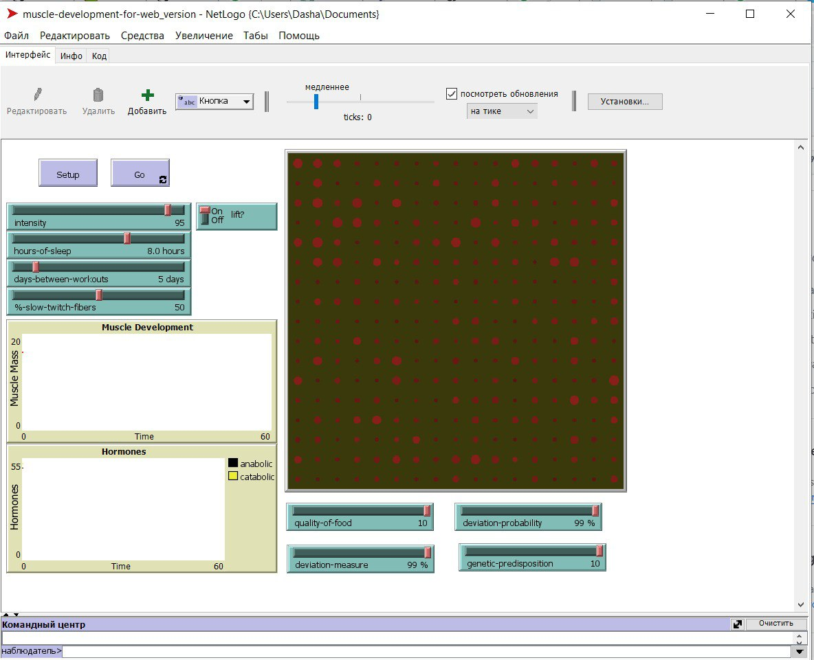
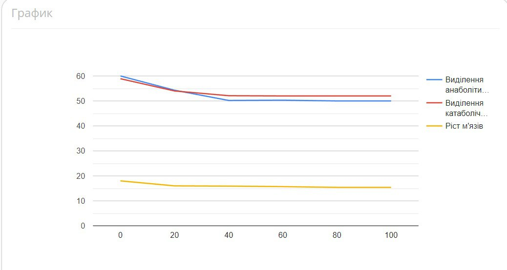

## Комп'ютерні системи імітаційного моделювання
## СПм-22-5, **Тимошенко Дар'я Олександрівна**
### Лабораторна робота №**2**. Редагування імітаційних моделей у середовищі NetLogo

 

### Варіант 12, модель у середовищі NetLogo:
[Muscle Development](http://www.netlogoweb.org/launch#http://www.netlogoweb.org/assets/modelslib/Sample%20Models/Biology/Muscle%20Development.nlogo)

 

### Внесені зміни у вихідну логіку моделі, за варіантом:

**Додано вплив харчування на можливість зростання м'язової маси.**
Для цього була створена нова процедура quality-food. Якість їжі є одним з найголовніших параметрів при наборі м'яз, тому, чим здоровіша їжа, тим більший набір маси.
<pre>
to quality-food
  ;; simulate hormonal effect of healthy food
  ask patches [
    set catabolic-hormone catabolic-hormone - 0.6 * (log catabolic-hormone 10) * quality-of-food
    set anabolic-hormone anabolic-hormone - 0.7 * (log anabolic-hormone 10) * quality-of-food
  ]
end
</pre>
Та додана до процедури go:
<pre>
to go
  ;; note the use of the LOG primitive in the procedures called below
  ;; to simulate a natural system's tendency to adapt less and less
  ;; to each additional unit of some biological substance
  perform-daily-activity
  if lift? and (ticks mod days-between-workouts = 0)
    [ lift-weights ]
  sleep
  genetic
  quality-food
  regulate-hormones
  develop-muscle
  set muscle-mass sum [fiber-size] of muscle-fibers
  tick
end
</pre> 
В інтерфейсі була оголошена глабольна змінна quality-of-food та додан повзунок до інтерфейсу (можно побачити на фото в кінці результату).

**Додано регулюємі користувачем параметри, що визначають вірогідність та міру тимчасового відхилення від вказаних початкових значень інтенсивності тренувань, кількості годин сну та днів між тренуваннями**
Тимчасова міра визначає негативне віхилення від значень. Додано до процедури setup:
<pre>
to setup
  clear-all
  set-default-shape muscle-fibers "circle"
  initialize-hormones
  new-muscle-fibers
  set hours-of-sleep (hours-of-sleep - (hours-of-sleep / 100 * deviation-measure / 100 * deviation-probability))
  set days-between-workouts (days-between-workouts - (days-between-workouts / 100 * deviation-measure / 100 * deviation-probability))
  set intensity (intensity - (intensity / 100 * deviation-measure / 100 * deviation-probability))
  set muscle-mass sum [fiber-size] of muscle-fibers
  reset-ticks
end
</pre>
Формула була створена таким чином-знаходимо процент міри тимчасового відхилення від заданих параметрів, віднімаємо від початкового значення параметру та множимо на процент вірогідності такого відхилення. В інтерфейсі були оголошені глабольні змінни deviation-measure та deviation-probability та додани повзунки до інтерфейсу (можно побачити в кінці результату).

### Внесені зміни у вихідну логіку моделі, на власний розсуд:

**Додано вплив генетики людини на швидкість зростання м'яз.**
Для цього була створена нова процедура genetic. 
<pre>
to genetic
  ;; simulate hormonal effect of human genetic
  ask patches [
    set catabolic-hormone catabolic-hormone - 0.3 * genetic-predisposition
    set anabolic-hormone  anabolic-hormone - 0.4 * genetic-predisposition
  ]
end
</pre>
Та додана до процедури go:
<pre>
to go
  ;; note the use of the LOG primitive in the procedures called below
  ;; to simulate a natural system's tendency to adapt less and less
  ;; to each additional unit of some biological substance
  perform-daily-activity
  if lift? and (ticks mod days-between-workouts = 0)
    [ lift-weights ]
  sleep
  genetic
  quality-food
  regulate-hormones
  develop-muscle
  set muscle-mass sum [fiber-size] of muscle-fibers
  tick
end
</pre> 
В інтерфейсі була оголошена глабольна змінна genetic-predisposition та додан повзунок інтерфейсу (можно побачити в кінці результату).

Фінальний код моделі та її інтерфейс доступні за [посиланням](muscle-development-for-web_version.nlogo).
 

## Обчислювальні експерименти
### 1. Вплив міри тимчасового відхилення параметрів інтенсивносі, кількості годин сну та днів між тренуваннями на зріст м'язових волокон
Досліджується залежність росту м'язів протягом певної кількості тактів (50) від міри тимчасового відхилення параметрів інтенсивносі, кількості годин сну та днів між тренуваннями, зазначеного на початку симуляції.
Експерименти проводяться при 10-99 процентів міри , з кроком 20, усього 6 симуляцій.  
Інші керуючі параметри мають значення за замовчуванням:
- **hours-of-sleep**: 8;
- **lift**: 1;
- **days-between-workouts**: 5;
- **%slow-twitch-fibers**: 50;
- **genetic-predisposition**: 10;
- **deviation-probability**: 10;
- **intensity**: 95;
- **quality-of-food**: 100%.
<table>
<thead>
<tr><th>Міра тимчасового відхилення параметрів</th><th>Виділення анаболітичного гормону</th><th>Виділення катаболічного гормону</th><th>Ріст м'язів</th></tr>
</thead>
<tbody>
<tr><td>0</td><td>53.1</td><td>53.3</td><td>16</td></tr>
<tr><td>20</td><td>54.3</td><td>54</td><td>16</td></tr>
<tr><td>40</td><td>50.2</td><td>52</td><td>15</td></tr>
<tr><td>60</td><td>50.3</td><td>52.1</td><td>15.7</td></tr>
<tr><td>80</td><td>50</td><td>52</td><td>15.4</td></tr>
<tr><td>99</td><td>50</td><td>52</td><td>15.4</td></tr>
</tbody>
</table>

Графік наочно показує, що при невеликій інтенсивності тренування виділяється майже однакова кількість анаболітитчного і катаболітичного гормону, що не дає великого розвитку м'яз, можна зробити висновок, що оптимальна інтенсивність тренування дорівнює 90.

 

